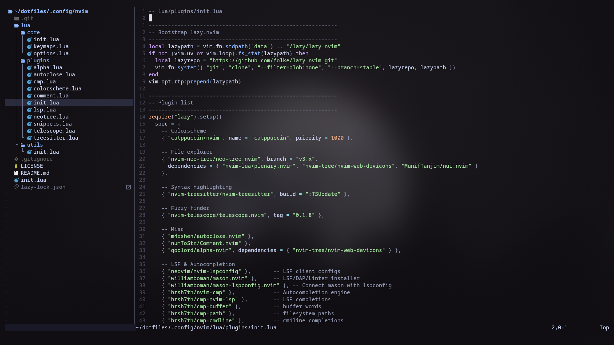

# 🌙 My Neovim Config

A modern **Neovim setup** built with [lazy.nvim](https://github.com/folke/lazy.nvim), designed to be **lightweight, fast, and feature-rich**.  

It includes **LSP, snippets, fuzzy finding, syntax highlighting, and a polished UI** out of the box.

---

## 🚀 Features

- **Plugin Management** via [lazy.nvim](https://github.com/folke/lazy.nvim)
- **Catppuccin Mocha** colorscheme with transparent background
- **Neo-tree** for file & buffer navigation
- **Telescope** for fuzzy finding files, grep, and buffers
- **Treesitter** for modern syntax highlighting
- **LSP setup** with [mason.nvim](https://github.com/williamboman/mason.nvim)  
  - Lua, Python, Java, C/C++ pre-configured
- **nvim-cmp** for autocompletion (LSP + buffer + path + snippets)
- **LuaSnip + friendly-snippets** for snippet expansion
- **Comment.nvim** for easy commenting
- **Autoclose.nvim** for auto-closing brackets & quotes
- **Alpha-nvim** dashboard with ASCII art
- **presence.nvim** discord rich presence for neovim

---

## 📦 Installation

1. **Clone this repo** into your Neovim config directory:

   ```bash
   git clone https://github.com/ak-mishra03/nvim ~/.config/nvim
   ```

2. **Launch Neovim** and plugins will install automatically:

   ```bash
   nvim
   ```

3. Done ✅

---

## ⚙️ Options

Configured in `lua/core/options.lua`:

- `mapleader = " "` (space as leader key)
- Relative line numbers
- Tabs = 2 spaces (`tabstop=2`, `shiftwidth=2`)
- `scrolloff = 8`, `sidescrolloff = 8` → keeps text comfortably centered  
- `expandtab = true` → always use spaces

---

## ⌨️ Keymaps

Configured in `lua/core/keymaps.lua`:

### 🗂️ Neo-tree
- `<C-n>` → Toggle file explorer (left)
- `<leader>bf` → Open buffer list (floating)

### 🔍 Telescope
- `<leader>ff` → Find files
- `<leader>fg` → Live grep
- `<leader>fb` → Open buffers
- `<leader>fh` → Help tags

### ⚡ LSP (via `lua/plugins/lsp.lua`)
- `gd` → Go to definition
- `K` → Hover docs
- `gi` → Go to implementation
- `<leader>rn` → Rename symbol
- `<leader>ca` → Code action
- `gr` → References
- `<leader>f` → Format buffer
- `<leader>e` → Check error/hint details

### ✨ Autocompletion
- `<C-Space>` → Trigger completion menu
- `<CR>` → Confirm selection
- `<Tab>` / `<S-Tab>` → Navigate completion or snippets

---

## 📜 Plugins

Defined in `lua/plugins/init.lua`:

- **UI**
  - `catppuccin/nvim` – colorscheme
  - `alpha-nvim` – dashboard
- **Navigation**
  - `neo-tree.nvim` – file explorer
  - `telescope.nvim` – fuzzy finder
- **Editing**
  - `nvim-treesitter` – syntax highlighting
  - `autoclose.nvim` – auto-close brackets/quotes
  - `Comment.nvim` – easy commenting
- **LSP & Completion**
  - `nvim-lspconfig`, `mason.nvim`, `mason-lspconfig.nvim`
  - `nvim-cmp` + `cmp-nvim-lsp` + `cmp-buffer` + `cmp-path` + `cmp-cmdline`
  - `LuaSnip`, `cmp_luasnip`, `friendly-snippets`

---

## 🛠️ LSP Setup

- Managed by **mason.nvim**  
- Pre-configured servers:
  - `lua_ls` (Lua)
  - `pyright` (Python)
  - `jdtls` (Java)
  - `clangd` (C/C++)

Extra servers can be installed easily:

```bash
:Mason
```

---

## 🎨 UI Preview

- **Catppuccin Mocha** theme  
- Transparent background enabled  
- Centered cursor with `scrolloff=8`  
- Dashboard on startup (Alpha.nvim)  

---

## 🧩 Extending

To add more plugins, edit `lua/plugins/init.lua`:

```lua
{ "tpope/vim-fugitive" } -- Example: Git integration
```

To change keymaps:  
`lua/core/keymaps.lua`

To tweak options:  
`lua/core/options.lua`

---

## 📸 Screenshot


---

## 📝 License

MIT – free to use & modify.
